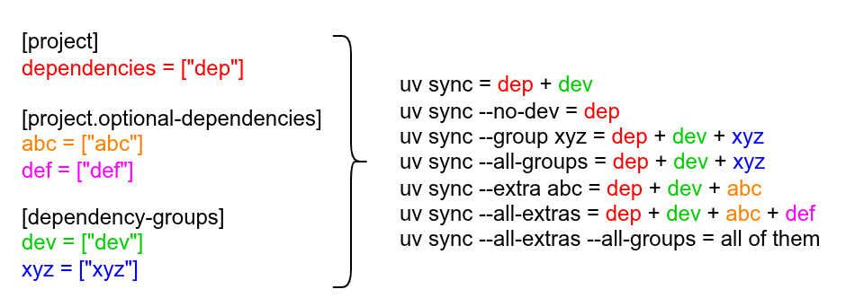

# pypkg42 - Modern Python Package Sample

A modern Python package sample demonstrating best practices.  
The practices may evolve over time.

## Project Structure

```bash
pypkg42/
├── src/
│   └── pypkg42/              # Main package source code
│       ├── __init__.py       # Package initialization and version info
│       ├── __main__.py       # Module entry point for python -m pypkg42
│       ├── cli.py            # Command-line interface with ASCII art banner
│       ├── py.typed          # PEP 561 marker for type checking support
│       └── core/             # Core functionality modules
│           ├── __init__.py   # Core module initialization
│           └── add.py        # Addition operations (add, add_multiple)
├── tests/                    # Test suite
│   ├── __init__.py           # Test package initialization
│   └── test_add.py           # Tests for addition functions
├── docs/                     # Documentation assets
│   └── uv_syncs.png          # Dependency sync workflow diagram
├── pyproject.toml            # Project configuration and dependencies
├── uv.lock                   # Locked dependency versions
├── .python-version           # Python version specification
├── README.md                 # Project documentation
├── LICENSE                   # MIT License
└── .gitignore                # Git ignore patterns
```

## Managing Dependencies with `uv`

This project uses [uv](https://github.com/astral-sh/uv), a fast Python package installer and resolver.  
Here's how the project was set up:

```bash
# Install uv
curl -fsSL https://astral.sh/uv/install.sh | sh

# Initialize a new project with uv
uv init --lib --build-backend setuptools -p 3.10 pypkg42
cd pypkg42

# Set project version
uv version 1.0.0

# Bump project version
uv version bump <PART>  # where <PART> is one of: major, minor, patch

# Add runtime dependencies
uv add numpy

# Add optional dependencies (for plotting features)
uv add --optional plot matplotlib

# Add development dependencies
uv add --dev pytest ruff  # equivalent to --group dev <PACKAGE>

# Add grouped development dependencies
uv add --group <GROUP> <PACKAGE>

# See the current dependencies
uv tree
```

## Build and Publish

```bash
# Build the project
uv build

# Publish to TestPyPi
uv publish --publish-url https://test.pypi.org/legacy/

# Publish to PyPi
uv publish --publish-url https://upload.pypi.org/legacy/
```

## Environment Installation After Cloning the Project

```bash
# All the following commands will install the project dependencies
# Default behavior: install development dependencies, i.e., dev group
uv sync

# Disable the development dependencies
uv sync --no-dev

# Include dependencies from the specified dependency group
uv sync --group <GROUP>

# Include all group dependencies
uv sync --all-groups

# Include optional dependencies from the specified extra name
uv sync --extra <EXTRA>

# Include all optional dependencies
uv sync --all-extras

# Include all groups and all optional dependencies
uv sync --all
```



## Usage

```bash
# Import as a module
uv run python -c "import pypkg42; print(pypkg42.__version__); print(pypkg42.__doc__)"

# Run module as a script
uv run python -m pypkg42

# Run installed binary (recommended)
uv run pypkg42
```

Providing a binary is recommended, which is defined in `pyproject.toml` under `[project.scripts]`.

## Testing

```bash
uv run pytest
```

Related configurations can be found in `pyproject.toml` under `[tool.pytest.ini_options]`.

## Development Tools

```bash
# Check code issues
uv run ruff check src

# Fix code issues
uv run ruff check --fix src

# Check code formatting
uv run ruff format --check src

# Check diff before format
uv run ruff format --diff src

# Format code
uv run ruff format src
```

## How to Import this Module in Another Project

Let `uv` manage your dependencies.

1. Remotely

   `pypkg42` is currently published on TestPyPI.  
   If the package has a different index, manually specify it.

   ```toml
   [project]
   dependencies = ["pypkg42>=1.0.0"]

   [tool.uv]
   index-strategy = "unsafe-best-match"

   [tool.uv.sources]
   pypkg42 = { index = "test-pypi" }

   [[tool.uv.index]]
   name = "test-pypi"
   url = "https://test.pypi.org/simple"
   ```

   Then run `uv sync` to install the dependency.  
   If the package is on the default PyPI, simply add it as follows:

   ```bash
   uv add pypkg42
   ```

2. Locally

   ```bash
   uv add --editable path/to/pypkg42
   ```

   The command will add the dependency with the path information.

   ```toml
   [project]
   dependencies = ["pypkg42"]

   [tool.uv.sources]
   pypkg42 = { path = "path/to/pypkg42", editable = true }
   ```

## How to Install the Application in the System

1. Remotely: without clone and directly from GitHub

   ```bash
   uv tool install pypkg42 --from git+https://github.com/HuaTsai/pypkg42
   uv tool uninstall pypkg42
   ```

2. Locally: with clone the repository

   ```bash
   uv tool install .
   uv tool uninstall pypkg42
   ```
